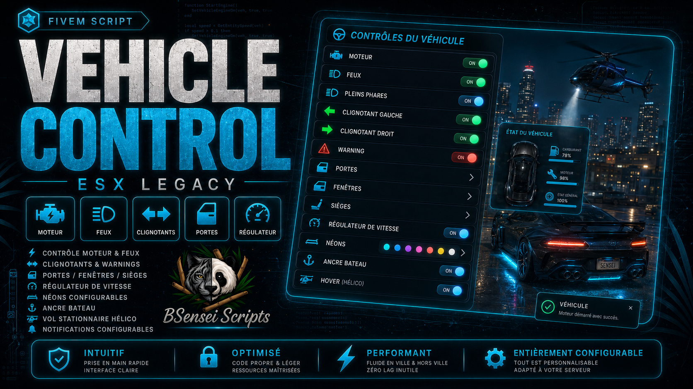

  

# 🚘 COMPLETE VEHICLE CONTROL

Take full control of your vehicles through a modern, intuitive and fully configurable interface!

---

## 🌆 Overview

BSensei Vehicle Control improves vehicle management on your FiveM server running **ESX Legacy**.

All the main features are brought together in one clear and easy-to-use menu.

The script automatically adapts to cars, boats and helicopters to display only the options compatible with the vehicle being used.

---

# 🔥 Main Features

## 🚗 Full Vehicle Control

Players can manage the following directly from the menu:

- Start and stop the engine
- Low beams and high beams
- Left and right turn signals
- Hazard lights
- Open and close doors
- Open the hood and trunk
- Window controls
- Seat switching

---

## 🏎️ Cruise Control

Players can select and maintain a speed directly from the menu.

The minimum and maximum speeds are fully configurable in `config.lua`.

---

## ⚓ Boat Anchor

Boats and jet skis include an anchor system that allows them to remain in position.

The anchor can be activated from the menu, with a command or with a configurable key.

The script automatically checks the boat's speed before allowing the anchor to be activated.

---

## 🚁 Helicopter Hover Mode

Helicopters can maintain their position, altitude and heading.

Hover mode remains active when changing seats as long as someone remains inside the aircraft.

When all players leave the helicopter, hover mode is automatically disabled.

---

## 💜 Neon Controls

The script only detects neon lights that are actually installed on the vehicle.

Players can:

- Enable or disable the neon lights
- Control each side independently
- Use several configurable lighting effects

A vehicle without installed neon lights will not be able to activate them artificially.

---

## 🎨 Modern Interface

The menu features a smooth, clear and immersive NUI interface.

Players can quickly control their vehicle without using several different commands or scripts.

Features that are incompatible with the vehicle being used are automatically disabled.

---

## ⚙️ Simple Configuration

Everything can be customized in `config.lua`:

- Menu opening command and key
- Anchor and hover mode commands
- Cruise control limits
- Maximum speed allowed for anchor activation
- Available features depending on the vehicle
- Neon lighting effects
- Messages and notifications
- Interface colors and appearance

---

# 💻 Technologies and Dependencies

| Component | Requirement |
|-----------|-------------|
| Framework | ESX Legacy |
| Interface | Modern NUI |
| Database | None |
| SQL File | Not required |
| Main Dependency | `es_extended` |

---

# 🎮 Commands & Interactions

| Command | Description |
|---------|-------------|
| **F5** | Open the Vehicle Control menu |
| **/vehiclemenu** | Open the menu via command |
| **/ancre** | Drop or raise the anchor |
| **/stationnaire** | Enable or disable helicopter hover mode |

> **Note:** Keys can be changed directly from the FiveM settings.

The anchor and hover mode shortcuts do not block commands used while the player is inside a car.

---

# 📦 Included in the Package

- ✅ BSensei Vehicle Control script
- ✅ Complete configuration file
- ✅ Modern NUI interface
- ✅ French & English translations
- ✅ Complete documentation
- ✅ Official BSensei Scripts Discord support

---

# 🚘 One Menu to Control All Your Vehicles!

With **BSensei Vehicle Control**, your players finally have a complete menu to manage their cars, boats and helicopters.

Control, immersion and simplicity... everything is included.

---

## 📥 Download

[Download BSensei Vehicle Control on Tebex](https://sensei-scripts-store.tebex.io/package/7559119)

## 📚 Documentation

[Official GitBook Documentation](https://bsensei-script.gitbook.io/bsensei-script-documentation-officiel-fivem/bsensei-vehicle-control-controle-complet-des-vehicules)
